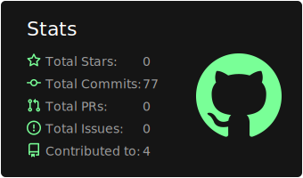
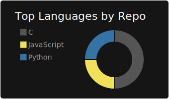

 

<h2 align="center">Hi 👋! My name is Ian and I'm an Informatics Engineering student interested in becoming a Full Stack Developer.</h2>

###

  
  

###

  
  
  
  
  
  
  
  
  
  
  
  
  
  
  
  
  

###

  
  
  
  
  

###

 

###

###
